# Synthetic Data Augmentation for Brain Tumour by using Deep Learning
## Bigtcoin Team, Hallym University Capstone Design

-----

## Directory
- ./DataPerpare : Data 전처리
- ./Model : 프로젝트에서 구현한 모델
- ./imges : Image assets for README
- <a href="./meet">./meet : 주차별 회의록</a>

## Contents
1. [소개 : 프로젝트에 대한 기본적 소개 및 목적](#Introduction)
2. [팀 : 팀원 및 역할](#Team)
3. [구축 DNN 모델 : 프로젝트 해결을 위한 구축모델 정의](#DNN-Model)
4. [문제해결 : 프로젝트를 해결과정](#Method)
    - [Data : 사용 데이터 셋](#Data)
    - [Seg-DNN : 뇌종양 검출모델](#Seg-DNN)
    - [Tumour Generator : 가짜 뇌종양 라벨 데이터 생성](#Tumour-Generator)
    - [Brain Generator : 가짜 뇌종양 뇌 MRI 데이터 생성](#Brain-Generator)
5. [결과 : 프로젝트의 결과](#Result)
5. [기대효과 : 프로젝트를 의의 및 확장성](#Benefit)
----

## Introduction

본 프로젝트를 통해 Deep Learning 모델학습을 위한 새로운 방법을 제시한다.

본 프로젝트에서 제안된 새로운 학습방법을 통해 뇌 MRI 이미지를 픽셀 단위로 종양 유무를 표시하는 Deep Neural Netork(DNN) 기반의 Image Segmentation 모델의 성능을 향상시키는 알고리즘을 개발하는 것이 주 목적이다. 

DNN 기반의 MRI 종양 Segmentation 성능향상을 위해 다음 2가지 주요 방법론으로 설계하고 최적화 한다.

1. MRI Image Segmentation을 위한 DNN 설계 (Seg-DNN)
2. Set-DNN의 성능을 최적화하기 위한 DNN 기반 Data Augmentation 기법설계

2번 방법인 Data Augmentation은 본 프로젝트를 통해 제안하는 새로운 방법이다. 

기존 Data Augmentation은 기하학적인 변환을 통해 유한한 학습데이터를 확장시키는 방법을 이용하지만 본 프로젝트에서는 인공데이터를 만들어 절대적인 학습데이터 양을 증가시켜 학습시키는 방법을 이용한다. 

## Team

BigtCoin

|Name|Department|Contact|
|---|---|---|
| Han ji yong | Hallym Univ | jyong0719@gmail.com
| Shin Dong Hyeon | Hallym univ | akqjq8694@gmail.com
| Chi Hyeon Gyu | Hallym univ | hyeongyuc96@gmail.com
| Choen jeong min | Hallym univ | c19960101@gmail.com

Coach
|Name|Department|Contact|
|---|---|---|
| Lim sung hoon | Hallym Univ(Prof.) | shlim@hallym.ac.kr

## DNN-Model

본 프로젝트에서 구성한 세부적인 모델은 다음과 같다. 

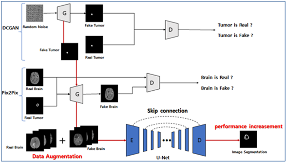

|Model Name|Function|Reference Model
|---|---|---|
|Tumour Generator | Generate Sysntheric Labeled Brain Tumour Data to apply Brain Generator | DCGAN
|Brain Generator| Generate Sysntheric Adnrmal Brain MRI Data to apply Seg-DNN | PIX2PIX
|Seg-DNN| Segmentation Brain Tumour (for prove values of sytheric datas generated from Tumour Generator | UNET

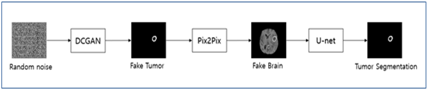

위에서 정의한 3가지 모델을 이용해 다음과 같은 구조로 Seg-DNN의 성능을 향상시키고자 한다. 

## Method
### Data

- 각 모델학습에 사용한 데이터

    |Model|학습데이터
    |---|---|---|
    |Tumour Generator | Label data(Brain Tumour) from Brats 2018 |
    |Brain Generator| Abnormal Brain data(Brain Tumour) from Brats 2018 |
    |Seg-DNN| Brain Tumour Data Pair from Brats 2018 |

- 학습된 모델의 입력 및 출력 데이터

    |Model|입력데이터|출력데이터
    |---|---|---|
    |Tumour Generator | 1*100 Gausian Noise | Syntheric Label data(Brain Tumour) |
    |Brain Generator| Label data(Brain Tumour) | Syntheric Abnormal Brain MRI Data |
    |Seg-DNN| Brain MRI Data | Segmentation Data(Brain Tumour) |

- <a href='https://www.med.upenn.edu/sbia/brats2018/data.html'>Brats2018</a> - Multimodal Brain Tumor Segmentation Challenge 2018

    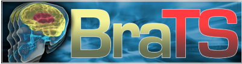

    - Label data : 실제 뇌종양 부분에 대한 정보
    - Abnormal Brain data : 뇌종양 MRI 사진
    - Brain Tumour Data Pair : Abnormal Brain Data + Label data

---

### Seg-DNN
 - 뇌종양을 진단을 위한 기계학습 모델
 - Unet 구조기반

#### Network Structure

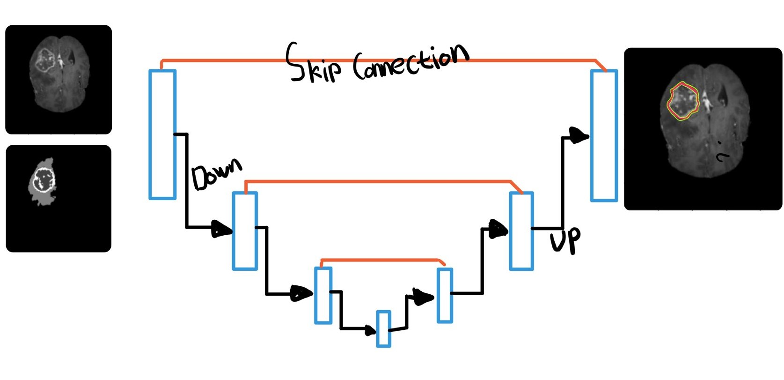</img>

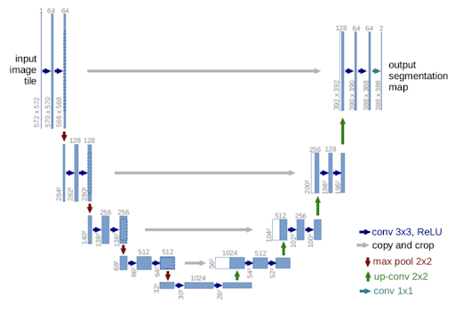</img>

Seg-DNN은 U-Net구조를 참고하여 구현하였다.

U-Net은 Biomedical 분야에서 이미지 분할(Image Segmentation)을 목적으로 제안된 End-to-End 방식의 Fully-Convolutional Network 기반 모델이다. 네트워크 구성의 형태(‘U’)로 인해 U-Net이라는 이름이 붙여졌다. U-Net은 이미지의 전반적인 Context(Semantic Information) 정보를 얻기 위한 네트워크와 정확한 지역화(Localization)를 위한 네트워크가 대칭 형태로 구성되어 있다.

U-net의 진행은 크게 Contracting Path, Expanding Path로 나뉜다. Expanding Path의 경우 Contracting Path의 최종 특징 맵으로부터 보다 높은 해상도의 Segmentation 결과를 얻기 위해 몇 차례의 Up-sampling을 진행한다. 다시 말해, Coarse Map에서 Dense Prediction을 얻기 위한 구조이다. 또한, U-Net은 FCN의 Skip Architecture 개념도 활용하여 얕은 층의 특징 맵을 깊은 층의 특징 맵과 결합하는 방식을 사용한다. CNN 네트워크의 Feature hierarchy의 결합을 통해 Segmentation이 내제하는 Localization과 Context사이의 트레이드오프를 해결할 수 있다. 

The Contracting Path는 (3x3)크기로 convolutions을 두 차례씩 반복 하며, 활성화 함수는 ReLU로 하고, Max-pooling을 (2x2)크기로 한다. 또한, Down-Sampling 마다 채널의 수를 2배로 늘린다. Expanding Path는 Contracting Path와 반대의 연산으로 특징 맵을 확장한다.

본 실험에서는 240*240 크기의 Abnormal Brain을 넣어 Brain Tumor를 분할하도록, U-net구조의 모델을 Layer별로 수정하여 학습시켰다.

#### Output
- Real Brain(좌) vs Seg-DNN을 통해 검출한 뇌종양부분 (우)

 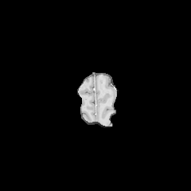</img> </img> 

---

### Tumour-Generator
- 가짜 뇌종양 라벨 데이터(Syntheric Brain Tumour Label data) 생성모델
- DCGAN 구조기반

#### Network Structure

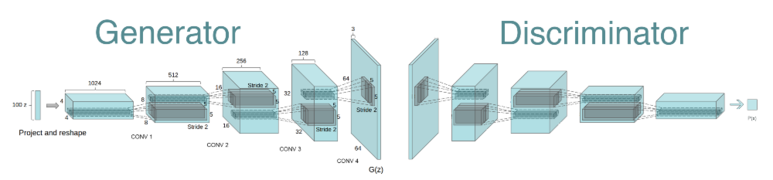</img>

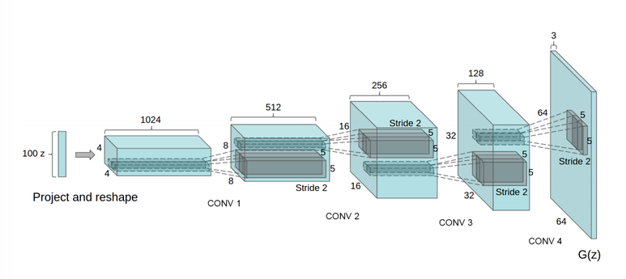</img>

Tumour Generator 모델의 경우 DCGAN을 참고하여 구현하였다.

DCGAN의 Generator의 구조는 위 사진의 좌측 부분과 같으며, DCGAN 모델은 Random-Noise를 Input으로 넣으면 최종 출력 이미지는 64X64크기로 출력 된다.

하지만, 본 실험에서는 최종 출력 이미지를 128X128크기의 이미지로 출력하기 위해 Layer를 수정하였다.

DCGAN의 Discriminator의 구조는 위 사진의 우측 부분과 같으며, Discriminator는 64X64크기의 이미지를 입력 받아 True와 False의 결과를 출력한다.

하지만, 본 실험에서는 128X128 크기의 Input이미지를 입력 받기 위해 Layer를 수정하였다. 활성화함수로는 아래 그림에서 확인할 수 있듯이 LeakyReLU를 사용한다. LeakyReLU는 기존 ReLU와 달리 음수영역의 값을 버리지 않고 가져온다.

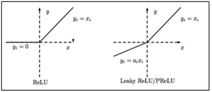</img>

#### Output
-  Tumour Generator를 이용한 Syntheric 뇌종양 라벨 데이터 생성 과정

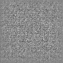{: width="200" height="200"}
-----

### Brain-Generator
- 가짜 뇌종양 MRI 데이터(Syntheric Abnormal Brain MRI Data) 생성모델
- PIX2PIX 구조기반

#### Network Structure

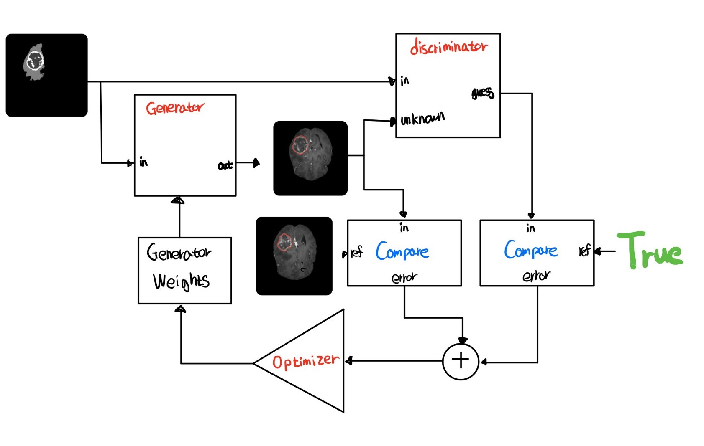</img>

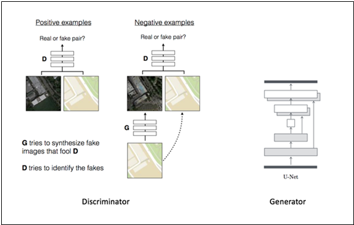</img>

다음은 Brain Generator의 모델구조이다. Pix2Pix구조를 기반으로 Brain Generator를 구현하였다. 

Pix2Pix 는 Generator와 Discriminator로 이루어져 있으며 Generator 기본 구조는 U-Net과 비슷한 구조로 구성된다. U-Net은 Encoder-decoder구조에 그림과 같이 대칭되는 Skip Connection을 추가한 형태이다. Skip Connection 추가를 통해 원래 이미지의 정보를 전달받을 수 있어 Decoder의 학습이 잘 되지 않는 문제를 해결할 수 있다. 입력 이미지와 목표로 하는 이미지가 상당히 유사하기에 이와 같은 구조를 가지고 있다.

Pix2pix의 Discriminator 기본구조는 Patch-GAN구조이다. L1 Loss를 사용하고 참고 이미지와 비슷한 이미지를 만드는 것을 돕는다. 이것은 Low-Frequency에서 너무 다른 이미지가 생기는 것을 막아준다.

즉, Discriminator는 High-Frequency에서 구분하는 것에 주 목적을 둔다. 이미지를 N X N 크기의 Patch로 나누고, 각각의 Patch에 대해서 참/거짓을 판별한 뒤, 참이 많으면 참으로, 거짓이 많으면 거짓으로 분류하는 방법이다. 더 지역적인 특징이 반영되므로, High-frequency에서 구분하는 데 적절하다. Patch Size가 작을수록, 전체 매개변수의 수가 작아지므로, 학습 속도가 빨라진다.

## Result
본 프로젝트에서 뇌종양 검출을 위한 딥러닝 모델을 정의한 후, 학습에 필요한 데이터를 생성하여 데이터 종류에 따라 학습이 모델의 성능에 미치는 영향을 확인해 보았다.
사용한 데이터에 따른 학습은 다음과 같이 세 가지로 구분할 수 있다.

1. 보유한 데이터만 사용한 학습
2. 기하학적 변환 을 통한 데이터 증가 후 학습
3. Gan 모델을 통한 데이터 증가 후 학습

총 세 가지 경우를 비교해 봤을 때 Brain Generator를 사용해 만든 Fake data 가 학습에 있어 가장 효과적이였다.

#### Tumour Generator)와 Brain Generator를 통해 생성한 Fake Data와 진짜 데이터 비교

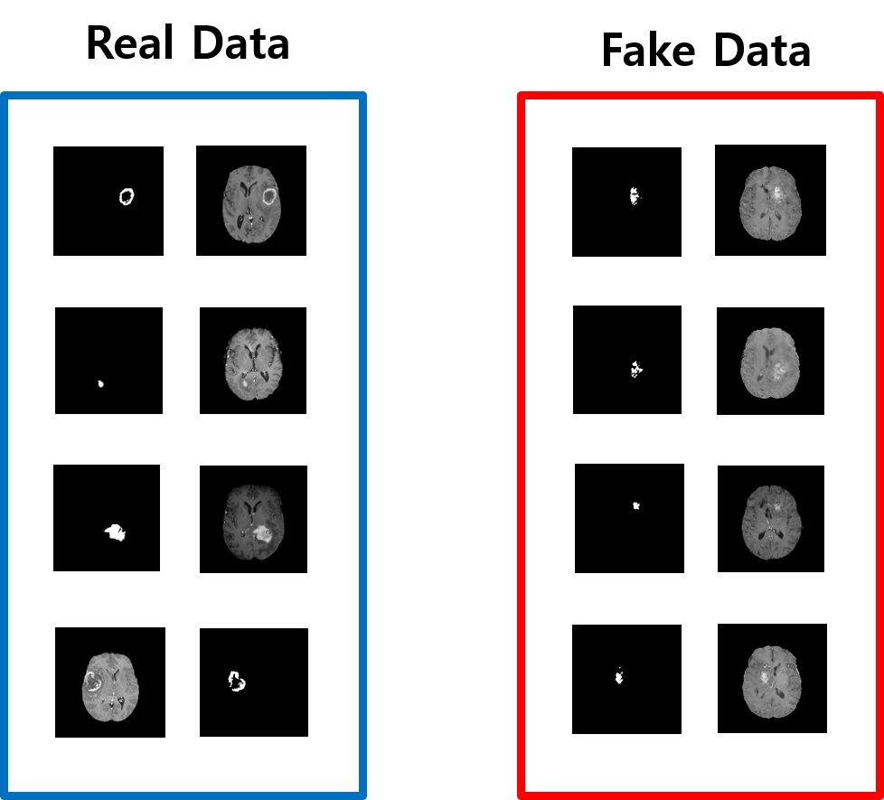</img>

TG(Tumour Generator)와 BG(Brain Generator)를 통해 생성한 데이터들이 실제 데이터와 차이가 없음을 확인하기 위해 PCA와 T-sne 분석 방법을 사용했다.   

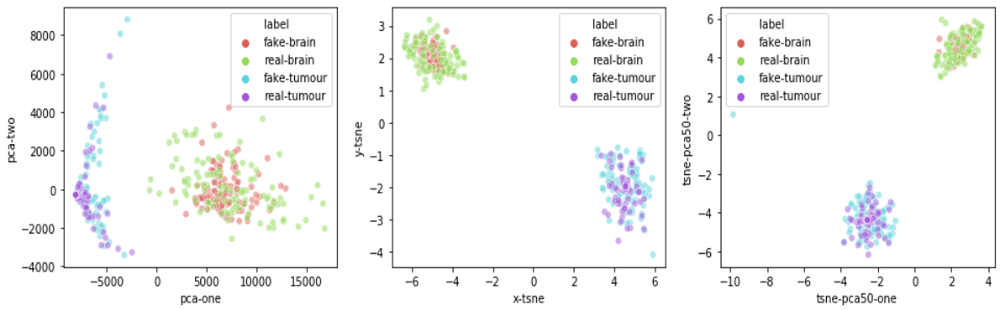</img>

PCA와 t-sne는 모두 데이터 차원을 축소하여 주성분을 분석하는 방법으로 실험에서 사용한 240x240 크기의 데이터를 2차원으로 축소하였다.

위 그림은 실제 Brain Tumor 데이터와 Brain Generator와 Tumour Generator를 통해 생성한 데이터를 PCA를 사용해 나타낸 산점도 그래프와 T-sne를 사용해 나타낸 산점도 그래프 그리고 PCA를 통해 50차원 축소 후 T-sne를 통해 2차원으로 축소한 산점도 그래프이다.

위 그래프에서 볼 수 있듯이 Tumor와 Brain은 경계가 확실하게 나뉘어져 있으며 서로 다른 데이터 성분으로 인식하고 있다. 반면, Fake Data와 Real Data는 잘 섞여 있는 것으로 보아 TG와 BG로 생성한 데이터가 실제 데이터와 유사함을 나타내고 있다.

#### 사용한 데이터에 따른 모델학습 Loss와 성능비교
본 프로젝트에서는 사용한 데이터에 따라 세 가지 경우로 분류하여 각각의 학습 오차와 모델의 검출성능을 비교했다. 

1. 실제 데이터 290개
2. 실제 데이터 290개 + 기하학적 변환 데이터 290개
3. 실제 데이터 290개 + TG, BG로 생성한 데이터 290개

- 사용한 데이터에 따른 Seg-DNN 모델학습 Loss

    
</img>

    학습 데이터의 대한 변화만을 확인하기 위해 학습 횟수와 오차 함수, 학습률, 최적화 알고리즘, 배치사이즈 등 Hyper Parameters는 모두 동일하게 진행하였다. 다음 도표는 세 가지 경우에 대한 Validation Loss를 측정한 것으로, Gan을 통해 생성한 Fake Data를 함께 학습 시켰을 때 Loss가 가장 많이 줄어든 것을 확인 할 수 있다. 

- 사용한 데이터에 따른 Seg-DNN 모델의 검출성능 비교
    
    

    |Traning about Data|IOU|
    |---|---|
    | Real | 58.9% |
    | Real + Transform | 60.45% |
    | Real + Fake | 63.233% |

    

    Test 데이터를 통한 모델의 성능 평가방법으로 다이스 계수를 포함했다.
    
    다이스 계수는 IOU(Intersection of Union)으로 전체 영역중의 겹친 부분을 수치화한 평가 척도다. 기존 데이터만을 사용한 학습모델의 다이스계수는 58.9%, 기존 데이터에 기하학적 변환을 이용해 데이터를 추가한 모델은 60.45%, Fake Data가 추가하여 학습한 모델은 63.233% 이었다.

    
다이스 계수(IOU)

    </img>
    
    

    
최종적으로 학습을 진행 할 때 오차가 감소하는 속도와 수치, 최종 U-Net 모델의 성능을 평가한 다이스계수를 종합적으로 비교해본 결과 TG와 BG를 통해 생성한 Fake data가 기존 Data Augmentation에 비해 효과적임을 알 수 있다.

## Benefit
1. 모델학습을 위한 학습 데이터의 수집 의존도 완화
2. 의학분야에서 가장 민감한 환자데이터 공유에 대한 문제 해결
3. 개인정보에 민감한 학습데이터 확보시 문제 해결

본 실험에서는 가짜 뇌종양 데이터를 생성하고 이를 활용해 뇌종양 검출모델의 성능을 개선시켰다. 결론적으로, 가짜 데이터가 뇌종양 검출 모델의 성능을 가장 높게 개선시켰으므로 생성한 가짜 데이터가 충분히 가치 있는 데이터임을 입증하였다. 즉, 학습에 필요한 가짜 데이터를 생성하는 것이 딥러닝 모델 학습에 있어 유의미한 과정이라고 할 수 있으며 이는 곧 딥러닝에 새로운 패러다임을 가져올 것이다. 

의료데이터의 경우 병리학적 발견이 드물기 때문에 데이터의 확보가 현저히 적으며 환자 개인의 정보이므로 데이터를 함부로 사용하는 것은 민감한 문제를 야기할 수 있다. 본 실험에서와 같이 의료 분야에서 가짜 데이터를 생성한다면 익명화된 의료 데이터를 충분히 확보할 수 있어 개인 정보에 관계없이 사용하는 것이 가능하다. 

가짜 데이터를 통해 딥러닝 모델의 성능을 개선시키는 것은 의료데이터라는 한정된 영역에만 국한되어 적용되는 사항이 아니다. 현재 데이터 부족을 겪고 있는 딥러닝 모델은 다양한 분야에 존재하며 이를 본 실험의 매커니즘을 접목한다면 훨씬 높은 성능을 기대할 수 있을 것이다.

딥러닝 분야는 현재 빠르게 발전을 이루고 있으며 컴퓨터가 사람을 뛰어넘을 만큼 다양한 문제를 해결하고 있다. 딥러닝의 발전은 곧 인류의 발전에 기여하는 가치 있는 일이며 본 실험이 그 가치에 빛을 더 해줄 것이다.