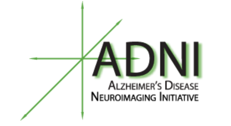
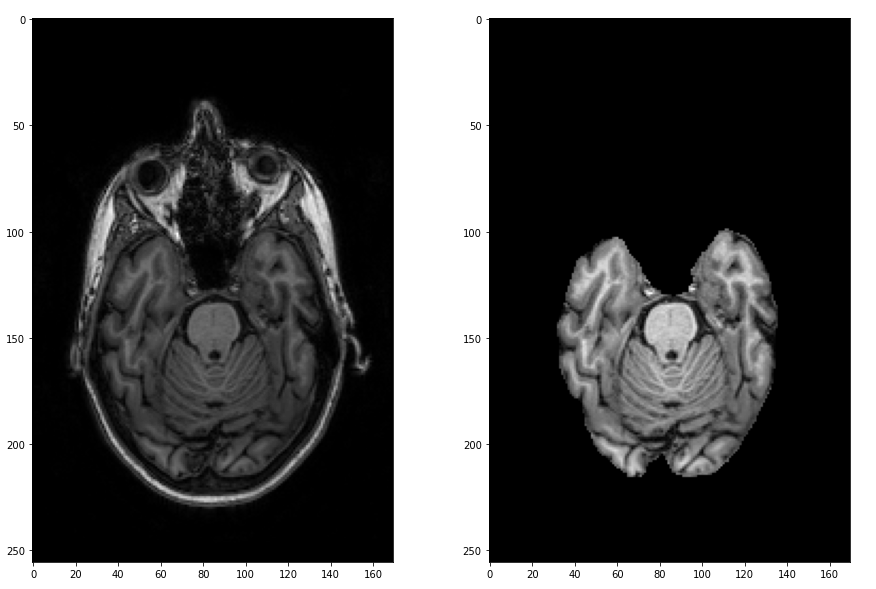
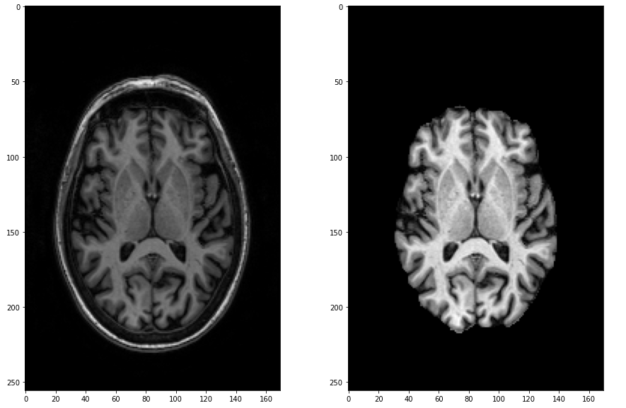

# Synthetic Data Augmentation for Brain Tumour by using Deep Learning
## Bigtcoin Team, Hallym University Capstone Design

-----

## Directory
- ./Model_A : Synthetic Data를 생성하는 모델
- ./Model_B : Synthetic Data의 가치를 평가하는 모델
- ./imges : Image for README
- <a href="./meet">./meet : 주차별 회의록</a>

## Contents
1. [소개 : 프로젝트에 대한 기본적 소개](#Introduction)
2. [팀 : 팀원 및 역할](#Team)
3. [기능 : 프로젝트의 구체적 목적, 구체적 기능](#Function)
4. [문제해결 : 프로젝트를 해결과정](#Method)
    - [Data : 사용 데이터 셋](#Data)
    - [Model A : 가짜 뇌종양 이미지 생성](#Model-A)
        - [데이터 전처리 : 두개골 제거](#Skull-Stripping)
        - [모델구조 : pix2pix](#Pix2pix)
    - [Model B : 뇌종양 판별](#Model-B)
5. [결과:프로젝트의 결과](#Result)
5. [기대효과 : 프로젝트를 의의 및 확장성](#Benefit)
----

## Introduction

데이터의 다양성은 Deep Learning 모델학습에 있어 많은 비중을 차지하고 있습니다.
의료영상 데이터의 경우 일반적으로 병리학적 발견이 드물기 때문에 불균형한 경우가 많으며, 이는 딥러닝 모델을 학습할 때 중요한 과제를 제기합니다. 즉 딥러닝 모델학습을 위해 충분한 데이터는 필수불가결하며 딥러닝이 데이터에 대해 상당히 의존적임을 의미합니다.

우리는 이를 해결하기 위한 새로운 패러다임을 제시합니다. 
 즉 모델학습을 위한 가치있는 데이터를 무한히 생성함으로서 현재 딥러닝학습에서 겪고있는 가장 중요한 과제를 해결하고자 합니다.

딥러닝 모델학습을 위해 생성된 가짜 데이터가 기존모델의 정확도를 끌어올릴 수 있다면 이는 딥러닝 모델학습에 있어 향상된 성능을 제공할 것입니다. 이는 곧 임의로 만들어진 가짜데이터가 유의미함을 의미하며 학습 데이터확보에 있어 많은 수고를 덜어줄 것입니다. 우리는 딥러닝기술을 활용해 실제 존재하지 않는 데이터를 생성하고 그것이 충분히 가치있는 데이터임을 증명하고자 합니다.

딥러닝 모델 학습을 위한 가짜 데이터의 생성은 다양한 분야에 적용될 수 있지만 의료분야로 축약하여 주제를 잡은 이유는 다음과 같습니다.

현재 의학분야에서 인공지능이 활발하게 응용되고 있으며 병리진단이나 암 부위 추출 등 의료영상 분석분야에서 널리 사용되고 있습니다. 하지만 이를 위한 학습데이터는 쉽게얻기 어렵습니다. 환자데이터의 익명성을 보장하며 학습시킬 수 있도록 착안된 Federated learning 또한 데이터 부족문제를 해결하기 위해 보안된 방법입니다.

우리팀의 프로젝트를 통해 인류의 건강과 번영에 도움이 되었으면 좋겠습니다.

## Team

BigtCoin

|Name|Department|Contact|
|---|---|---|
| Han ji yong | Hallym Univ | jyong0719@gmail.com
| Shin Dong Hyeon | Hallym univ | akqjq8694@gmail.com
| Chi Hyeon Gyu | Hallym univ | hyeongyuc96@gmail.com
| Choen jeong min | Hallym univ | c19960101@gmail.com

Coach
|Name|Department|Contact|
|---|---|---|
| Lim sung hoon | Hallym Univ(Prof.) | shlim@hallym.ac.kr

## Function

|Model|Function|
|---|---|
|Model A | Generate Sysntheric Brain Tumour Data |
|Model B | Classfication Brain Tumour (for prove values of sytheric datas generated from Model A |

>Model A에서 생성한 데이터를 통해 기존의 모델 정확도가 향상된다면 그 데이터는 정확도 향상에 기여한 것이므로 가치있는 데이터라 판단합니다.

>Model A의 가치있는 데이터를 판단하기 위한 척도로서 다음과 같은 실험을 시행합니다.

|Model|Measure|
|---|---|
A |실제 데이터만 이용한 Model B Accuracy |
B | Model A에서 생성한 가짜 데이터만 이용한 Model B Accuracy |
C | 실제 데이터와 Model A에서 생성한 가짜 데이터를 이용한 Model B Accuracy |

>A < C 일 경우, 가짜 데이터가 기존모델의 정확도를 향상시켰으므로 Model A를 통해 만들어진 가짜 데이터는 가치있는 것이며 즉, 만들고자 하는 Model A가 가치있는 뇌종양 데이터를 생성함

* *데이터 = (Brain Tumour Image, Labeled image with brain Tumour segmentation)*

## Method
### Data

- <a href="http://adni.loni.usc.edu/">Alzheimer's Disease Neuroimaging Initiative | ADNI</a>

   
    > 정상뇌 MRI 데이터    

    
</img>

- <a href="https://www.med.upenn.edu/sbia/brats2018/data.html">Multimodal Brain Tumor Image Segmentation Benchmark (BRATS) data set</a>

    > 뇌종양 MRI 데이터
    
</img>

---

### Model A 
> 가짜 뇌종양 데이터(이미지)를 생성합니다.

#### Skull Stripping

    데이터 전처리 과정으로 MRI 데이터에서 두개골을 제거합니다.

</img>
</img>

#### Pix2Pix
    종양사진으로 뇌종양 사진을 생성합니다.

- Model Structure

</img>

-----

### Model B
> 뇌종양을 진단을 위한 기계학습 모델입니다.

#### Segmentation
    뇌종양사진에서 뇌종양 부분을 검출합니다.

  - Model Structure

</img>

---

## Result
프로젝트 결과입니다.
## Benefit
1. 모델학습을 위한 가치있는 데이터 증가
2. 의학분야에서 가장 민감한 환자데이터 공유에 대한 문제 해결
3. 실제 의료데이터를 이용해 새로운 의료데이터 생성
