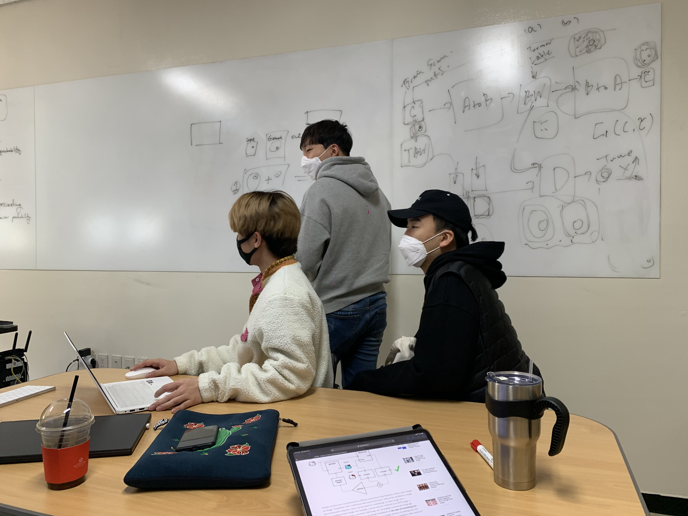
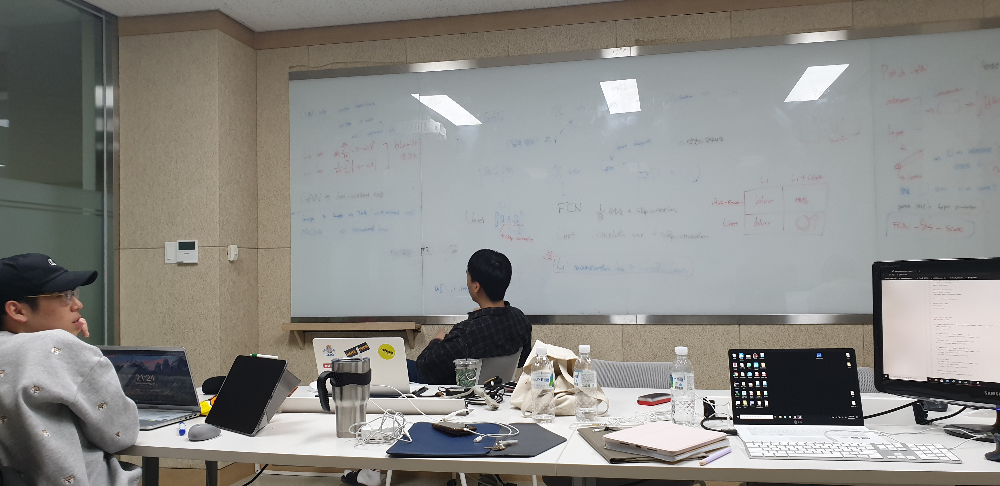

# 회의록

## 3월 16일
### 미팅내용
- 사진 동양화 프로젝트 : 재밋있어 보이는 주제이지만 학습에 필요한 동양화 데이터 충분할지 의문, 주제에 너무 얽매이지 말고 각자 재미있어 보이는 주제탐색

- 작년 1등 수상작 (운동자세교정)과 CCTV 불법주차차량 검출프로젝트 등 참신한 아이디어 + 실제시연가능시 완성도에 높은 점수를 줌, 즉 기술을 시연할 수 있는 애플리케이션 개발도 염두해두는 것을 권장

- 인공지능과 딥러닝의 기초이론 설명

### 과제
1. 각자 딥러닝을 이용한 재밋는 프로젝트 5개씩 찾아오기(되도록 Pytorch권장)
    - GITHUB, Google 권장
    - 한글보단 영어로 검색(Fun Porject using deep learning)

2. GAN을 이용해 동양화 프로젝트 프로토타입 만들기(기존 고흐코드이용해 동양화의 적은 데이터로도 가능한지 확인해보기)

3. 각자 인공지능 공부(미팅마다 한주동안 스터디 후 교수님께 질문)

## 3월 23일
- 딥러닝 공부
- 가주제 선정 
- 캡스톤 신청서 작성

## 3월 30일
- 뇌종양 가짜 이미지 생성 주제 최종선정
- 학습데이터 및 관련논문 탐색

## 4월 6일
- 학교 GPU자원 서버할당
- Synteric Image 논문분석
- Unet Image Segmentation 논문분석
- Model B (Classification Brain Tumour) 개발

## 4월 15일
- 중간보고서 완료
- Synteric Image 논문분석
- CGAN 및 U-net 원리공부
- 뇌종양, 정상뇌 데이터 확보

## 4월 21일
- Unet vs Pix2Pix 구조알아보기
- Synthetic image 관련논문 완벽숙지
- Brats 데이터전처리 및 ANDI 데이터 전처리

## 4월 28일
- 전체 딥러닝 모델구조 수립
- Unet Prototype Model 개발

</img>

## 5월 4일
- Pix2Pix 구조 기반 Brain Generator 개발
- Unet 구조 기반 Seg-DNN model 개발

## 5월 9일
- DCGAN 구조 알아보기
- Unet 구조 기반 Seg-DNN model 최적화
</img>

## 5월 14일
- DCGAN 구조 기반 Tumor Generator 개발
- Seg-DNN 최적화 완료

## 5월 21일
- Tumor Generator 최적화 완료
- Brain Generator 최적화 완료

## 5월 27일
- Tumor Generator를 이용한 Fake Tumor 생성
- Brain Generator를 이용한 Fake Brain 생성
- Data Augmentation을 통한 Seg-DNN 성능 평가

## 6월 3일 
- 다이스 계수, TSNE, PCA 구현

## 6월 10일 
- 최종 보고서  작성 완료

## 6월 17일 
- 최종 Github 정리

